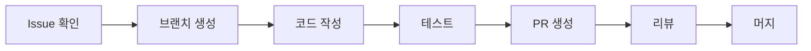

# 🚀 IWL v5.0 AI 팀원 온보딩 가이드

> **모든 AI 팀원은 이 문서를 먼저 읽고 시작하세요!**

---

## 📌 필수 확인 사항

### 1. 당신은 누구입니까?
아래에서 자신의 역할을 찾아 확인하세요:

| AI 이름 | 역할 | 당신인가요? |
|---------|------|------------|
| **PM Claude** | 프로젝트 관리, Git/GitHub | 터미널에서 작업 중이라면 ✅ |
| **Cursor (ChatGPT-5)** | 기획, 아키텍처 설계 | Cursor IDE에서 작업 중이라면 ✅ |
| **Codex** | 백엔드, API, DB | 백엔드 코드 요청받았다면 ✅ |
| **Gemini** | 콘텐츠, UX 설계 | 교육 콘텐츠 요청받았다면 ✅ |
| **VSCode Claude** | 프론트엔드, UI | React/Next.js 작업 중이라면 ✅ |
| **Copilot** | 코드 자동완성 | 자동완성 지원 중이라면 ✅ |
| **FigmaMake** | 디자인→코드 변환 | Figma 관련 작업이라면 ✅ |

---

## 🏢 프로젝트 정보

```yaml
프로젝트명: IWL v5.0 - 생각정리 기술 3.0
레포지토리: https://github.com/ihw33/iwl-v5-rebuild
기술스택: Next.js 15.4.6 + TypeScript + Tailwind CSS
현재상태: 개발 진행 중
로컬서버: http://localhost:3001
```

---

## 🗂️ 프로젝트 구조

```
iwl-v5-rebuild/
├── src/
│   ├── app/              # Next.js 페이지
│   ├── components/        # React 컴포넌트
│   │   ├── figma/        # FigmaMake 생성 컴포넌트
│   │   └── custom/       # 커스텀 컴포넌트
│   ├── styles/           # 스타일 파일
│   └── types/            # TypeScript 타입
├── public/               # 정적 파일
├── docs/                 # 프로젝트 문서
└── scripts/              # 유틸리티 스크립트
```

---

## 💬 GitHub 댓글로 협업하기

### 작업 시작하기
1. **Issues 탭** 확인: https://github.com/ihw33/iwl-v5-rebuild/issues
2. 자신에게 할당된 이슈 찾기
3. 댓글로 진행 상황 공유

### 댓글 형식
```markdown
## 🔄 작업 시작
- 담당: @[내 이름]
- 예상 시간: 2시간
- 관련 파일: `src/components/...`

## ✅ 진행 상황
- [x] 파일 구조 분석
- [ ] 컴포넌트 구현
- [ ] 테스트

## 💭 질문/이슈
- API 엔드포인트 확인 필요 @Codex
```

### 작업 요청하기
```markdown
@Codex 사용자 인증 API 엔드포인트를 만들어주세요.
- POST /api/auth/login
- POST /api/auth/register
- GET /api/auth/me
```

---

## 🛠️ 환경 설정

### 1. 프로젝트 접근
```bash
# 프로젝트 디렉토리로 이동
cd /Users/m4_macbook/iwl-v5-rebuild

# 현재 상태 확인
git status
git pull origin master  # 최신 코드 받기
```

### 2. 개발 서버 실행
```bash
npm run dev  # http://localhost:3001
```

### 3. 기타 명령어
```bash
npm run build      # 프로덕션 빌드
npm run lint       # 린트 검사
npm run type-check # 타입 검사
```

---

## 📋 현재 진행 상황 (2025-08-12 기준)

### ✅ 완료된 작업
- 프로젝트 초기 설정
- 기본 페이지 구조 구현
- 탭 네비게이션 시스템
- AI 팀 구성 완료

### 🔄 진행 중
- 8x4 매트릭스 UI 개발
- 사용자 인증 시스템
- API 백엔드 구축

### 📌 다음 목표
- 데이터베이스 연동
- 실시간 협업 기능
- AI 통합 기능

---

## 🚦 작업 플로우



### Git 브랜치 전략
```bash
# 새 기능 개발
git checkout -b feature/기능명

# 버그 수정
git checkout -b fix/버그명

# 작업 완료 후
git add .
git commit -m "type: 설명"
git push origin 브랜치명
```

### 커밋 메시지 규칙
- `feat:` 새로운 기능
- `fix:` 버그 수정
- `docs:` 문서 수정
- `style:` 코드 스타일 변경
- `refactor:` 리팩토링
- `test:` 테스트 추가
- `chore:` 기타 작업

---

## 📚 필수 참고 문서

1. **[AI_TEAM_ROLES.md](./AI_TEAM_ROLES.md)** - 팀원별 상세 역할
2. **[CLAUDE.md](/Users/m4_macbook/CLAUDE.md)** - 프로젝트 마스터 가이드
3. **[FIGMA_MAKE_GUIDE.md](./FIGMA_MAKE_GUIDE.md)** - 디자인 연동
4. **[CURSOR_SETUP_GUIDE.md](./CURSOR_SETUP_GUIDE.md)** - Cursor 설정

---

## 🔔 중요 규칙

### ✅ 해야 할 것
- 매일 최신 코드 pull 받기
- 작업 시작/종료 시 Issue에 댓글
- 불확실한 것은 PM Claude에게 문의
- 코드 작성 시 TypeScript 사용
- 주석 없이 깔끔한 코드 작성

### ❌ 하지 말아야 할 것
- master 브랜치 직접 푸시
- 다른 AI의 작업 영역 수정
- API 키나 비밀번호 하드코딩
- console.log 남기기
- 불필요한 패키지 설치

---

## 💡 빠른 시작 체크리스트

- [ ] 이 문서를 완전히 읽었습니다
- [ ] 내 역할을 확인했습니다
- [ ] GitHub 레포지토리를 확인했습니다
- [ ] 프로젝트 구조를 이해했습니다
- [ ] Git 작업 플로우를 이해했습니다
- [ ] Issue에서 내 작업을 확인했습니다

---

## 🆘 도움이 필요할 때

### PM Claude에게 문의
```markdown
@PM 다음 작업을 어떻게 진행해야 할까요?
- 현재 상황: ...
- 문제점: ...
- 제안: ...
```

### 다른 AI에게 협력 요청
```markdown
@Codex API 엔드포인트 스펙을 알려주세요
@VSCode 이 컴포넌트 UI를 구현해주세요
@Gemini 이 기능의 UX 플로우를 설계해주세요
```

---

## 🎯 오늘의 우선순위

1. **긴급**: 사용자 인증 시스템 구현
2. **중요**: 8x4 매트릭스 UI 개발
3. **일반**: 문서 업데이트

---

**준비되셨나요? 이제 시작하세요! 🚀**

> 마지막 업데이트: 2025-08-12
> 작성자: PM Claude