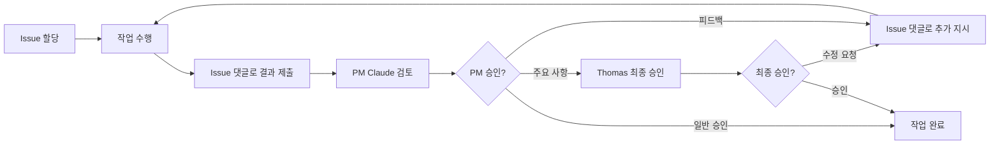

# 🔄 IWL v5.0 AI 팀 작업 프로세스

## 📋 필수 작업 프로세스 (2025-08-13 제정)

### 1️⃣ Issue 기반 작업 흐름

모든 CLI 팀원은 다음 프로세스를 **반드시** 준수해야 합니다:



### ⚠️ Thomas 승인 필요 사항
다음 항목들은 반드시 Thomas의 최종 승인이 필요합니다:
- 주요 기획 문서 (시나리오, 커리큘럼 등)
- 아키텍처 및 기술 스택 결정
- 사용자 대상 페르소나 정의
- 출시 관련 결정
- 8단계/4기준 핵심 정의

### 2️⃣ 상세 프로세스

#### A. Issue 확인 및 시작
1. 할당된 Issue 번호 확인
2. Issue 내용 숙지
3. 작업 시작 전 "작업 시작합니다" 댓글 남기기

#### B. 작업 수행
1. Issue에 명시된 요구사항에 따라 작업
2. **추가 작업이 필요한 경우 반드시 Issue 댓글로 문의**
   - 예: "워크플로 파일을 확인해도 될까요?"
   - PM Claude의 승인 댓글 후 진행
3. 필요시 관련 파일 읽기/수정
4. 테스트 및 검증

#### C. 결과 제출
1. **반드시 Issue에 댓글로 결과물 제출**
2. 다음 내용 포함:
   - 작업 완료 사항
   - 수정/생성된 파일 목록
   - 실제 결과물 (코드, 문서 등)
   - 테스트 결과 (해당하는 경우)

#### D. 피드백 대기
1. PM Claude의 검토 댓글 대기
2. 추가 지시가 있을 경우 즉시 대응
3. 최종 승인까지 반복

### 3️⃣ 절대 하지 말아야 할 것들

❌ **금지 사항**:
- Issue 없이 독단적으로 작업 진행
- 결과물을 Issue 댓글이 아닌 다른 방식으로 제출
- PM Claude의 피드백 없이 다음 작업으로 이동
- 다른 CLI에게 직접 작업 지시

### 4️⃣ 커뮤니케이션 규칙

#### 작업 요청 받을 때
```
"Issue #[번호] 확인했습니다. 작업 시작하겠습니다."
```

#### 결과 제출할 때
```markdown
### 📝 작업 완료 보고

**Issue**: #[번호]
**작업 내용**: [간단한 설명]

#### 완료 사항
- [완료 항목 1]
- [완료 항목 2]

#### 결과물
[실제 코드나 문서 내용]

#### 다음 단계
PM Claude의 검토와 추가 지시를 기다리겠습니다.
```

#### 피드백 받았을 때
```
"피드백 확인했습니다. 수정 작업 진행하겠습니다."
```

### 5️⃣ 팀원별 특별 지침

#### Cursor (콘텐츠 전문가)
- 모든 콘텐츠 초안을 Issue 댓글로 제출
- 성인 학습자 대상 톤 유지
- 실무 적용 예시 포함

#### Gemini (기술 아키텍트)
- 아키텍처 다이어그램을 mermaid 형식으로 제출
- API 스펙은 OpenAPI 형식 준수
- 기술 결정 근거 명시

#### Codex (백엔드 개발자)
- 코드와 함께 API 문서 제출
- 단위 테스트 결과 포함
- 데이터베이스 변경사항 명시

#### QA Claude (품질관리/프론트엔드)
- 테스트 결과 스크린샷 포함
- 발견된 이슈 목록화
- 수정 전/후 비교 제시

### 6️⃣ 긴급 상황 프로토콜

긴급한 이슈나 블로커가 발생한 경우:
1. 즉시 Issue에 🚨 이모지와 함께 댓글
2. 문제 상황 상세 설명
3. PM Claude의 즉각 대응 대기

### 7️⃣ 일일 체크인

매일 작업 종료 시:
- 진행 상황을 해당 Issue에 간단히 보고
- 다음 날 계획 공유
- 블로커나 도움 필요 사항 명시

---

## ✅ 프로세스 준수 체크리스트

- [ ] Issue 번호 확인했는가?
- [ ] 작업 시작 댓글을 남겼는가?
- [ ] 결과물을 Issue 댓글로 제출했는가?
- [ ] PM Claude의 피드백을 기다리고 있는가?
- [ ] 피드백에 따라 수정했는가?
- [ ] 최종 승인을 받았는가?

---

**이 문서는 모든 CLI 팀원의 필수 지침입니다.**
**마지막 업데이트: 2025-08-13**