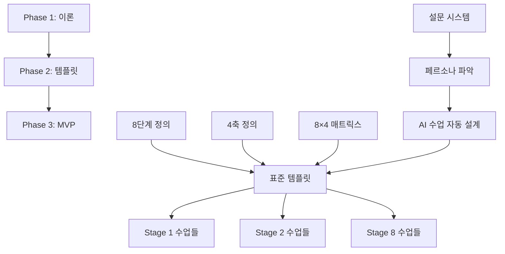

# 📚 IWL v5.0 문서 체계도

## 🎯 핵심 구조
```
IWL v5.0 = 8단계(Stage) × 4축(Axis) = 32개 모듈
목표: AI 협업 능력 향상을 위한 35분 수업 템플릿
```

## 📊 Phase별 문서 구조

### Phase 1: A 시리즈 (이론 체계) ✅
```
목적: 8×4 매트릭스 이론 정립
상태: 완료 (Issue #9, #10, #11, #12)
```

#### 핵심 산출물
1. **용어 정의** → `/docs/GLOSSARY.md`
   - 8단계 정의 (지각인지 → 철학적 인지)
   - 4축 정의 (정보처리, 사고조작, 추상화, 자기인식)

2. **4축 사고 성향** → `/docs/templates/Thinking_Style_4Axis_Design.md`
   - A1: 논리적/분석적 ↔ 직관적/창의적
   - A2: 계획적/체계적 ↔ 유연적/즉흥적
   - A3: 독립적/개인적 ↔ 협력적/소통적
   - A4: 행동적/실행적 ↔ 성찰적/분석적

3. **8×4 매트릭스** → B0_Standard_Template.md에 포함
   - 32개 셀 (각 Stage × 각 Axis 교차점)

---

### Phase 2: B 시리즈 (커리큘럼) 🔄
```
목적: 실제 수업 템플릿과 콘텐츠 개발
상태: 진행 중 (B0 템플릿 초안 작성)
```

#### B0: 표준 수업 템플릿 (초안)
1. **메인 템플릿** → `/docs/templates/B0_Standard_Template.md`
   - Frontend View (학습자용): 실습 중심
   - Backend System (제공자용): 데이터/측정

2. **예시 수업** → `/docs/templates/B0_Example_Tech_Proposal.md`
   - "기술 도입 제안서 만들기" 35분 수업

3. **데이터 구조** → `/docs/templates/B0_Template_Schema.json`
   - 모든 필드 정의
   - 메타데이터 구조

4. **AI 자동화** → `/ai_prompts/execution_prompts.md`
   - 페르소나 입력 → 자동 수업 설계
   - 3가지 모듈 조합 제안
   - Junior/Youth/Pro별 맞춤

#### B1-B8: 단계별 수업 (대기)
- B1: Stage 1 (지각 인지) 중심 수업들
- B2: Stage 2 (구별 인지) 중심 수업들
- ... (각 Stage별 수업 모음)

---

### Phase 3: MVP 및 실증 ⏹️
```
목적: 강사 챗봇 MVP 개발
상태: 대기 중
```

---

## 🔗 문서 간 관계



---

## 📁 주요 폴더 구조

```
iwl-v5-rebuild/
├── docs/
│   ├── GLOSSARY.md (핵심 용어)
│   ├── templates/ (B0 템플릿들)
│   └── DECISIONS/ (의사결정 기록)
├── ai_prompts/
│   ├── execution_prompts.md (자동화)
│   └── system_prompts/ (AI 체인)
├── sessions/ (작업 세션 기록)
│   ├── session_01/ (B0 초안 작성)
│   ├── session_02/ (설문 시스템)
│   └── session_03/ (진행 예정)
└── modules/ (32개 모듈 - 작성 대기)
```

---

## 🎯 현재 위치와 다음 단계

### 현재 상황
1. **완료**: 8×4 이론 체계 (Phase 1)
2. **진행 중**: B0 표준 템플릿 (초안 → 완성)
3. **대기**: B1-B8 개별 수업들

### 세션 03 작업
1. B0 템플릿 완성 (초안 → 최종)
2. 인지 목표 설정 가이드라인
3. 35분 수업 구성 상세화
4. 사고 성향 4축 질문 완성

### 핵심 원칙
- 모든 수업은 35분
- AI 도구 활용 필수
- 실습 중심 (이론 최소화)
- 대상별 맞춤 (Junior/Youth/Pro)

---

**작성일**: 2025-08-15
**목적**: 전체 문서 구조 파악용 지도