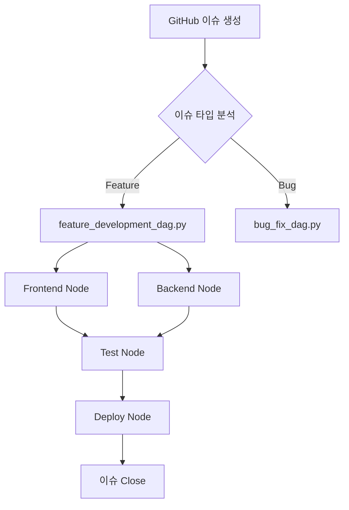

# 🔄 노드(Node)와 DAG 아키텍처 설명서

## 📌 개요
IWL v5.0 프로젝트는 ai-orchestra-v02의 **노드-DAG 시스템**을 활용하여 복잡한 워크플로우를 자동화합니다.

---

## 🎯 핵심 개념

### 1. 노드(Node)란?
**단일 작업 단위**를 처리하는 독립적인 실행 모듈
- 하나의 특정 기능 수행 (예: 이슈 분석, 코드 생성, 테스트 실행)
- 입력을 받아 처리 후 출력 생성
- 재사용 가능한 컴포넌트

### 2. DAG(Directed Acyclic Graph)란?
**워크플로우 오케스트레이션** - 여러 노드를 연결한 작업 흐름
- 방향성 있는 비순환 그래프
- 노드 간 의존성 관리
- 병렬/순차 실행 제어

---

## 📂 프로젝트 구조

```
ai-orchestra-v02/
├── nodes/                    # 개별 작업 노드들
│   ├── iwl_development_node.py     # IWL 개발 작업
│   ├── issue_analyzer_node.py      # 이슈 분석
│   ├── code_generator_node.py      # 코드 생성
│   ├── test_runner_node.py         # 테스트 실행
│   └── deployment_node.py          # 배포 작업
│
├── dags/                     # 워크플로우 정의
│   ├── iwl_development_dag.py      # IWL 개발 전체 플로우
│   ├── feature_development_dag.py  # 기능 개발 플로우
│   └── bug_fix_dag.py             # 버그 수정 플로우
│
└── orchestrator/            # 오케스트레이션 엔진
    └── dag_executor.py
```

---

## 🔗 노드와 DAG 조합 패턴

### 패턴 1: 선형 파이프라인
```python
# 순차적 실행
이슈_분석 → 코드_생성 → 테스트 → 배포
```

### 패턴 2: 병렬 처리
```python
# 동시 실행
        ┌→ Frontend_개발 →┐
이슈_분석 →                → 통합_테스트 → 배포
        └→ Backend_개발  →┘
```

### 패턴 3: 조건부 분기
```python
# 조건에 따른 분기
이슈_분석 → 타입_판단 → [버그수정 or 기능개발] → 테스트
```

---

## 💻 실제 사용 예시

### 1️⃣ 단일 노드 실행
```bash
# 특정 이슈에 대해 노드 실행
python nodes/iwl_development_node.py --issue-id 35
```

**노드 코드 예시:**
```python
# nodes/iwl_development_node.py
class IWLDevelopmentNode:
    def __init__(self, issue_id):
        self.issue_id = issue_id
    
    def execute(self):
        # 1. 이슈 데이터 가져오기
        issue = fetch_github_issue(self.issue_id)
        
        # 2. 작업 타입 분석
        task_type = analyze_task_type(issue)
        
        # 3. 페르소나 할당
        persona = assign_persona(task_type)
        
        # 4. 작업 실행
        result = execute_task(persona, issue)
        
        return result
```

### 2️⃣ DAG 워크플로우 실행
```bash
# 전체 개발 워크플로우 실행
python dags/iwl_development_dag.py --workflow=feature_development
```

**DAG 정의 예시:**
```python
# dags/iwl_development_dag.py
class IWLDevelopmentDAG:
    def __init__(self):
        self.nodes = {
            'analyze': IssueAnalyzerNode(),
            'frontend': FrontendDevelopNode(),
            'backend': BackendDevelopNode(),
            'test': TestRunnerNode(),
            'deploy': DeploymentNode()
        }
    
    def define_workflow(self):
        # DAG 정의
        workflow = {
            'analyze': ['frontend', 'backend'],  # 분석 후 병렬 실행
            'frontend': ['test'],                # 프론트 완료 후 테스트
            'backend': ['test'],                 # 백엔드 완료 후 테스트
            'test': ['deploy']                   # 테스트 후 배포
        }
        return workflow
    
    def execute(self):
        # DAG 실행 엔진
        executor = DAGExecutor(self.nodes, self.define_workflow())
        return executor.run()
```

---

## 🎭 페르소나와의 연결

### 노드별 페르소나 매핑
```python
NODE_PERSONA_MAPPING = {
    'frontend_development': 'Frontend Lead',
    'backend_development': 'Backend Lead',
    'ai_integration': 'AI/ML Lead',
    'testing': 'QA Lead',
    'deployment': 'DevOps Lead',
    'design': 'Design Lead'
}
```

### DAG 실행 시 페르소나 자동 활성화
1. DAG가 노드 실행 순서 결정
2. 각 노드가 적합한 페르소나 선택
3. 페르소나가 작업 수행
4. 결과를 다음 노드로 전달

---

## 🚀 언제 사용하나?

### 노드(Node) 사용 시점
- ✅ **단일 작업** 수행할 때
- ✅ **독립적인 기능** 테스트할 때
- ✅ **빠른 프로토타이핑**
- ✅ **특정 페르소나** 작업만 필요할 때

### DAG 사용 시점
- ✅ **복잡한 워크플로우** 관리
- ✅ **여러 팀/페르소나** 협업 필요
- ✅ **병렬 처리**로 속도 향상
- ✅ **의존성 관리** 필요
- ✅ **전체 개발 사이클** 자동화

---

## 📊 실행 플로우 예시

### GitHub 이슈 → 완료까지


---

## 🔧 실제 명령어 모음

```bash
# 1. 단일 노드 실행
python nodes/issue_analyzer_node.py --issue-id 35

# 2. IWL 개발 DAG 실행
python dags/iwl_development_dag.py --workflow=feature_development

# 3. 특정 이슈에 대한 전체 워크플로우
python orchestrator/dag_executor.py --issue-id 35 --auto

# 4. 병렬 실행 (Frontend + Backend 동시)
python dags/parallel_development_dag.py --components="frontend,backend"

# 5. 테스트만 실행
python nodes/test_runner_node.py --target=all
```

---

## 💡 핵심 이점

1. **자동화**: 수동 작업 최소화
2. **병렬성**: 독립 작업 동시 실행
3. **추적성**: 모든 단계 로깅
4. **재사용성**: 노드 조합으로 새 워크플로우
5. **확장성**: 새 노드/DAG 쉽게 추가

---

## 🎯 요약

**노드(Node)** = 레고 블록 하나
**DAG** = 레고 블록으로 만든 완성품

- 간단한 작업 → 노드 직접 실행
- 복잡한 워크플로우 → DAG로 오케스트레이션
- 페르소나는 각 노드에서 자동 할당되어 작업 수행

**"작은 노드들이 모여 큰 워크플로우를 만듭니다" 🔄**