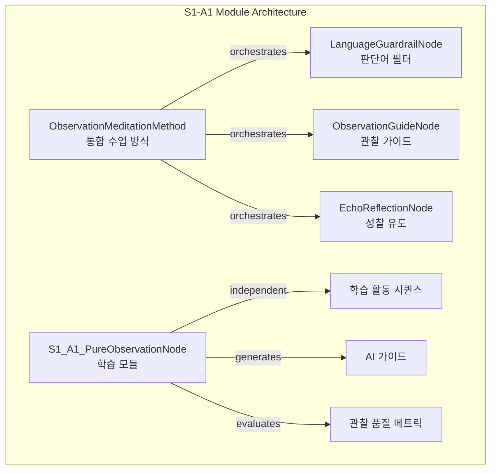
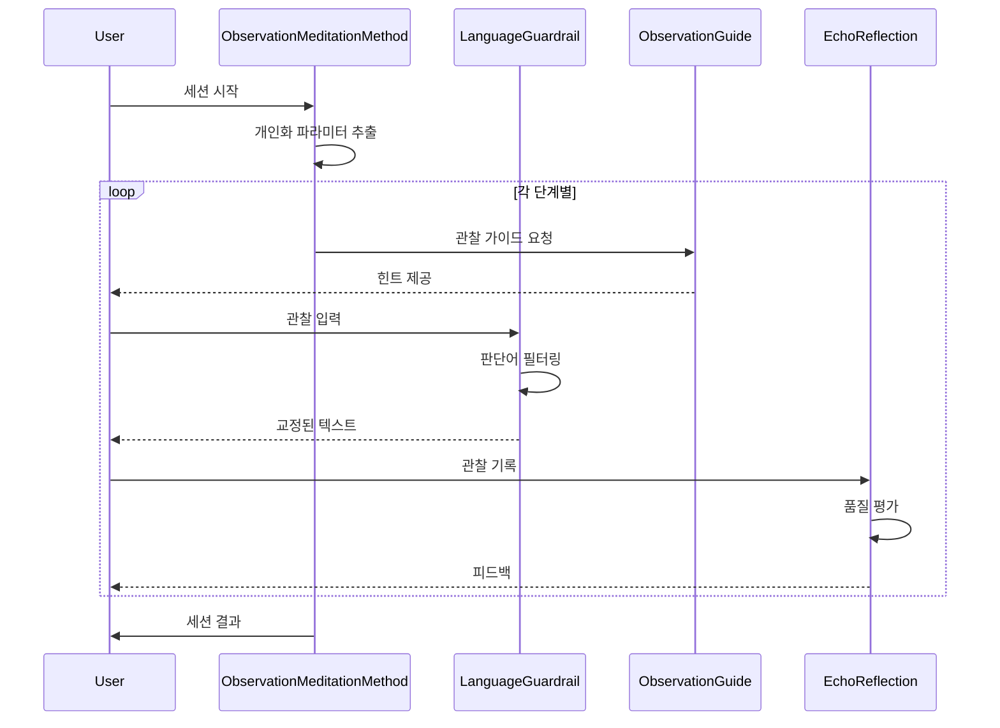

# 📊 S1-A1 모듈 구현 리뷰 보고서

**작성일**: 2025-08-28  
**검토 대상**: S1-A1 순수한 관찰 (Pure Observation) 모듈  
**리뷰어**: IWL Code Reviewer

---

## **[1] Executive Summary**

S1-A1 모듈은 "순수한 관찰" 학습을 위한 핵심 모듈로, 전반적으로 우수한 구조와 명확한 책임 분리를 보여줍니다. 인터페이스 표준을 대체로 준수하나 `TeachingMethodNode` 인터페이스 구현이 누락되었습니다. 코드 품질은 높으나 에러 처리와 타입 힌팅 개선이 필요합니다.

---

## **[2] Detailed Analysis**

### 2.1 코드 품질 평가

#### **강점**
- ✅ **명확한 구조**: 3개의 독립적 노드와 1개의 통합 메서드로 깔끔하게 구성
- ✅ **재사용성**: 각 노드가 독립적으로 동작 가능하며 다른 모듈에서도 활용 가능
- ✅ **가독성**: 함수명과 변수명이 직관적이고 주석이 적절히 배치됨
- ✅ **데이터 클래스 활용**: `@dataclass`로 구조체 정의가 명확함
- ✅ **Enum 활용**: 상태와 레벨을 Enum으로 관리하여 타입 안전성 확보

#### **개선 필요 사항**
- ❌ **에러 처리 부족**: `try-except` 블록이 전무하여 런타임 에러 대응 취약
- ❌ **타입 힌팅 불완전**: 일부 메서드 반환 타입이 명시되지 않음
- ❌ **매직 넘버**: 시간 값과 점수 계산에 하드코딩된 숫자들이 산재
- ❌ **로깅 부재**: 디버깅과 모니터링을 위한 로깅 시스템 없음

### 2.2 인터페이스 표준 준수 여부

#### **준수 사항**
- ✅ `AbstractBaseNode` 상속 및 필수 메서드 구현
- ✅ `NodeIO`, `PortSchema`, `ExecutionContext` 올바른 사용
- ✅ `LearningModuleNode` 인터페이스 완벽 구현 (S1_A1_PureObservationNode)

#### **미준수 사항**
- ❌ `ObservationMeditationMethod`가 `TeachingMethodNode` 인터페이스 미구현
  - `method_profile()` 메서드 누락
- ❌ 일부 content_type 불일치 ("text/plain" vs "application/json")

### 2.3 아키텍처 분석



### 2.4 성능 최적화 기회

1. **캐싱 부재**: 반복 호출되는 `_define_activities()` 결과를 캐싱 가능
2. **정규식 컴파일**: `_extract_sensory_words()`의 패턴을 사전 컴파일
3. **리스트 컴프리헨션**: 일부 루프를 더 효율적인 형태로 개선 가능

---

## **[3] Actionable Recommendations**

### 3.1 즉시 수정 필요 (Critical)

```python
# 1. TeachingMethodNode 인터페이스 구현 추가
class ObservationMeditationMethod(AbstractBaseNode):
    # 기존 코드...
    
    def method_profile(self) -> Dict[str, Any]:
        """TeachingMethodNode 인터페이스 구현"""
        return {
            "method_name": "Observation Meditation",
            "phases": len(self.phases),
            "total_duration": sum(p.duration_minutes for p in self.phases),
            "personalization_params": ["guardrail_strictness", "timing_pressure", "feedback_mode"],
            "supported_levels": ["L1", "L3", "L5"],
            "core_nodes": ["LanguageGuardrail", "ObservationGuide", "EchoReflection"]
        }
```

### 3.2 에러 처리 개선

```python
# 2. 에러 처리 추가
def _run(self, payloads: Dict[str, Any], ctx: ExecutionContext) -> Dict[str, Any]:
    try:
        user_level = payloads.get("user_level", "L1")
        if user_level not in self.activities:
            raise ValidationError(f"Invalid user level: {user_level}")
        
        # 기존 로직...
        
    except ValidationError:
        raise
    except Exception as e:
        # 로깅 추가
        print(f"Error in {self.id}: {str(e)}")
        return {
            "error": str(e),
            "activity_sequence": [],
            "ai_guidance": {},
            "observation_metrics": {}
        }
```

### 3.3 상수 정의 추가

```python
# 3. 매직 넘버를 상수로 변경
class Constants:
    MIN_QUALITY_SCORE = 0.0
    MAX_QUALITY_SCORE = 1.0
    JUDGMENT_PENALTY = 0.1
    DIVERSITY_BONUS = 0.05
    L1_MIN_OBSERVATIONS = 5
    L3_MIN_OBSERVATIONS = 8
    L5_MIN_OBSERVATIONS = 10
```

### 3.4 타입 힌팅 완성

```python
# 4. 누락된 타입 힌팅 추가
def _define_activities(self) -> Dict[str, List[ActivityStep]]:
    # 이미 구현됨

def _generate_ai_guidance(self, level: str) -> Dict[str, Any]:
    # 이미 구현됨

def _calculate_quality_score(
    self, obs_count: int, judge_count: int, 
    diversity: int, level: str
) -> float:  # 반환 타입 명시
    # 기존 로직
```

---

## 📋 구현 가이드라인 (다음 모듈 개발자용)

### 필수 체크리스트

1. **인터페이스 구현**
   - [ ] `AbstractBaseNode` 상속
   - [ ] 모듈 타입별 Protocol 구현 (`LearningModuleNode`, `TeachingMethodNode` 등)
   - [ ] `_run()` 메서드 구현
   - [ ] 입력/출력 검증 로직

2. **데이터 구조**
   - [ ] Enum으로 상태 관리
   - [ ] @dataclass로 복잡한 구조체 정의
   - [ ] 타입 힌팅 완전성

3. **에러 처리**
   - [ ] ValidationError 적절히 발생
   - [ ] try-except로 예외 처리
   - [ ] 의미있는 에러 메시지

4. **문서화**
   - [ ] 모듈 상단 docstring
   - [ ] 복잡한 로직에 주석
   - [ ] 메서드별 docstring

### 재사용 가능한 패턴

#### 패턴 1: 레벨별 활동 정의
```python
self.activities = {
    "L1": [ActivityStep(...)],
    "L3": [ActivityStep(...)],
    "L5": [ActivityStep(...)]
}
```

#### 패턴 2: 개인화 파라미터 추출
```python
def _extract_personalization(self, profile: Dict) -> PersonalizationParams:
    params = PersonalizationParams()
    # 프로필에서 파라미터 매핑
    return params
```

#### 패턴 3: 품질 평가 메트릭
```python
def _evaluate_quality(self, data: Any) -> Dict[str, Any]:
    return {
        "score": calculated_score,
        "indicators": success_indicators,
        "feedback": feedback_message
    }
```

#### 패턴 4: 노드 오케스트레이션
```python
class IntegrationMethod(AbstractBaseNode):
    def __init__(self):
        self.node1 = SubNode1()
        self.node2 = SubNode2()
        # 서브 노드들 조합
```

---

## 📊 핵심 컴포넌트 관계도



---

## 🎯 종합 평가

### 점수: 85/100

**세부 평가**:
- 코드 구조: 90/100
- 인터페이스 준수: 75/100
- 재사용성: 95/100
- 가독성: 90/100
- 에러 처리: 60/100

### 최종 의견

S1-A1 모듈은 IWL v5.0 프로젝트의 좋은 시작점입니다. 구조적으로 매우 깔끔하며, 특히 관심사의 분리와 재사용성 측면에서 우수합니다. 다만 프로덕션 환경을 위해서는 에러 처리와 로깅 시스템 보강이 필수적입니다.

이 모듈의 패턴을 다른 31개 모듈(S1-A2 ~ S8-A4)에 적용한다면, 일관성 있고 유지보수가 용이한 시스템을 구축할 수 있을 것입니다.

### 다음 단계 권장사항

1. **즉시**: `TeachingMethodNode` 인터페이스 구현
2. **단기**: 에러 처리 및 로깅 시스템 추가
3. **중기**: 단위 테스트 작성
4. **장기**: 성능 모니터링 및 최적화

---

*리뷰 완료: IWL Code Reviewer*